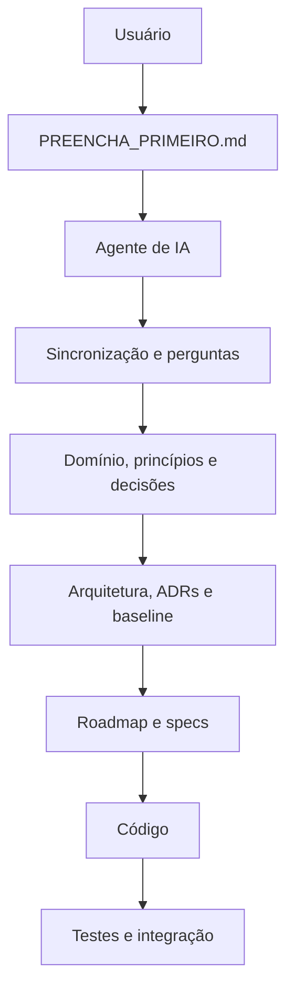
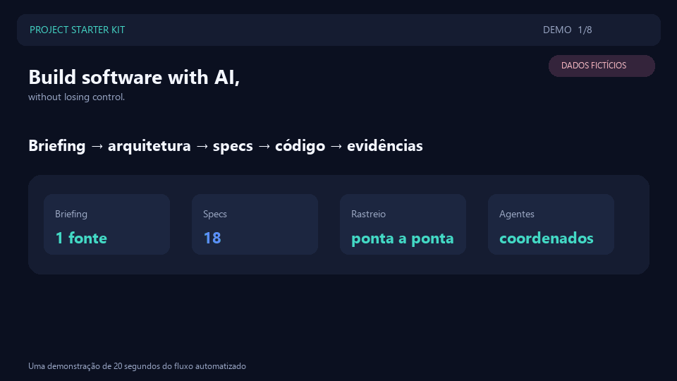

# Project Starter Kit

Template reutilizável para planejar e desenvolver projetos com requisitos rastreáveis, contexto recuperável por IA, decisões registradas e entregas verificáveis.

**Versão do kit:** `2.2.0`

> **Estado atual:** o projeto ainda está na fase de definição. O briefing em `PREENCHA_PRIMEIRO.md` precisa ser preenchido antes do planejamento da arquitetura e da implementação do produto.

## Por onde começar

1. Clone ou copie o repositório.
2. Leia `AGENTS.md`.
3. Preencha somente o arquivo `PREENCHA_PRIMEIRO.md`.
4. Adicione referências visuais, pesquisas e materiais de marca nas pastas indicadas pelo formulário.
5. Solicite a avaliação de complexidade e a sincronização dos documentos derivados.
6. Revise e aprove requisitos, arquitetura, tecnologias e baseline antes da implementação.

O arquivo `COMO_USAR_O_PROJECT_KIT.md` contém o passo a passo detalhado. Se houver dúvida sobre o modo de trabalho, consulte `COMO_AVALIAR_A_COMPLEXIDADE.md`.

## Fluxo em poucos segundos



`PREENCHA_PRIMEIRO.md` é a entrada do usuário. Os demais documentos operacionais são derivados e mantidos pelos agentes.

## Veja o fluxo em 20 segundos



> Os números e o projeto exibidos na demonstração são fictícios e servem apenas para apresentar o fluxo.

## Estrutura do repositório

```text
.
├── AGENTS.md                         # Regras obrigatórias para agentes
├── PREENCHA_PRIMEIRO.md              # Única entrada de requisitos do responsável
├── COMO_USAR_O_PROJECT_KIT.md         # Guia completo de utilização
├── COMO_AVALIAR_A_COMPLEXIDADE.md     # Critérios de modo leve ou completo
└── _project-kit/
    ├── VERSION                        # Versão estrutural independente do Kit
    ├── governance/                    # Motivação, princípios e autoridade documental
    ├── proposals/                     # Melhorias candidatas da metodologia
    ├── project/                       # Requisitos e decisões derivados
    │   ├── PROJECT_CONTEXT.md         # Resumo operacional para retomada
    │   ├── PROJECT_PRINCIPLES.md      # Princípios específicos opcionais
    │   ├── DOMAIN_GLOSSARY.md         # Vocabulário canônico opcional
    │   ├── RISKS.md                   # Registro de riscos
    │   ├── OPEN_DECISIONS.md          # Escolhas ainda não resolvidas
    │   └── adr/                       # Architecture Decision Records
    ├── planning/                      # Roadmap, backlog e sprints
    ├── docs/                          # Diagramas, fluxos e wireframes próprios
    ├── generated/                     # Dashboard e visões regeneráveis
    ├── specs/                         # Especificações e controle das entregas
    ├── reports/                       # Relatórios de execução
    ├── references/                    # Referências e pesquisas externas
    ├── brand/                         # Logos, imagens e fontes
    ├── ACTIVITY_LOG.md                # Linha do tempo de humanos e IAs
    ├── CHANGELOG.md                   # Evolução estrutural do kit
    └── scripts/                       # Verificações do fluxo
```

O código do produto deverá ser criado fora de `_project-kit/`. O kit deve permanecer no repositório enquanto o projeto estiver em desenvolvimento.

## Fluxo de trabalho

```text
Briefing → perguntas abertas → domínio e decisões → arquitetura e ADRs → roadmap
→ especificações → implementação → validação → integração → relatório
```

Nenhuma funcionalidade deve ser inventada para preencher lacunas do briefing. Requisitos indefinidos devem ser registrados como perguntas, e decisões relevantes devem ser aprovadas e documentadas antes da implementação.

`README.md` orienta a navegação, mas não governa decisões. Consulte
`_project-kit/governance/KNOWLEDGE_MODEL.md` para saber qual artefato é a fonte
oficial de cada tipo de conhecimento.

Para validar a prontidão de uma entrega no modo completo:

```powershell
node _project-kit/scripts/check-readiness.mjs
```

Para gerar as visões operacionais:

```powershell
node _project-kit/scripts/generate-project-views.mjs
```

## Colaboração

- Crie uma branch curta e descritiva para cada entrega.
- Trabalhe somente em uma especificação pronta ou em uma tarefa leve devidamente registrada.
- Preserve alterações existentes e mantenha cada commit focado.
- Não adicione credenciais, arquivos `.env`, chaves ou dados pessoais reais.
- Execute as validações indicadas na especificação antes de enviar a alteração.
- Abra o pull request com o objetivo, os arquivos alterados, as validações executadas e eventuais pendências.

Exemplo de início:

```powershell
git clone <URL-DO-REPOSITORIO>
cd "Project-Starter-Kit"
git switch -c docs/preencher-briefing
```

## Próximo passo

O responsável pelo projeto deve preencher `PREENCHA_PRIMEIRO.md`. Em seguida, a equipe pode iniciar a avaliação de complexidade e o planejamento usando a seguinte solicitação:

```text
Leia AGENTS.md e PREENCHA_PRIMEIRO.md.
Faça a avaliação de complexidade.
Valide se as respostas são suficientes e registre perguntas bloqueadoras.
Sincronize os documentos derivados do _project-kit sem inventar requisitos.
Proponha arquitetura, roadmap, funcionalidades e specs, mas não implemente até eu aprovar.
```
