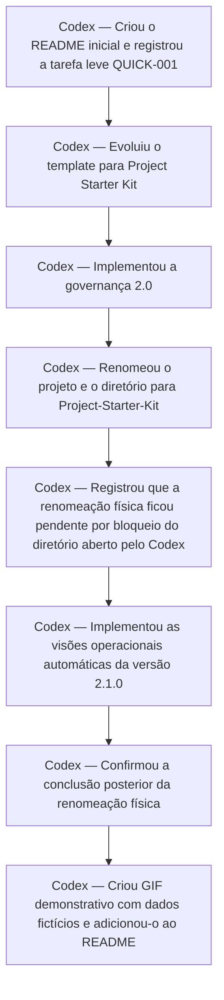

# Histórico de contribuições humanas e de IA

> Gerado automaticamente por `node _project-kit/scripts/generate-project-views.mjs`. Não edite manualmente.

| Ator | Contribuições registradas |
|---|---:|
| Codex | 8 |

> Esta visão deriva de `ACTIVITY_LOG.md` e não infere identidade, modelo ou autoria ausente.
