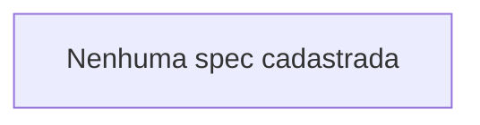

# Dependências entre specs

> Gerado automaticamente por `node _project-kit/scripts/generate-project-views.mjs`. Não edite manualmente.

| Spec | Depende diretamente de | Estado | Dependências concluídas? |
|---|---|---|---|
| — | — | — | — |
