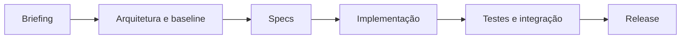

# Linha do tempo

> Gerado automaticamente por `node _project-kit/scripts/generate-project-views.mjs`. Não edite manualmente.

| Data | Marco | Evidência |
|---|---|---|
| 2026-07-20 | Codex — Criou o README inicial e registrou a tarefa leve QUICK-001 | `README.md`; `specs/QUICK-001.md`; `specs/QUICK_TASKS_LOG.md` |
| 2026-07-20 | Codex — Evoluiu o template para Project Starter Kit | `project/PROJECT_CONTEXT.md`; `planning/`; `project/adr/`; `docs/`; validadores aprovados |
| 2026-07-20 | Codex — Implementou a governança 2.0 | `CHANGELOG.md`; `project/RISKS.md`; `project/OPEN_DECISIONS.md`; templates e validadores |
| 2026-07-20 | Codex — Renomeou o projeto e o diretório para Project-Starter-Kit | título da tarefa; `README.md`; diretório `Project-Starter-Kit` |
| 2026-07-20 | Codex — Registrou que a renomeação física ficou pendente por bloqueio do diretório aberto pelo Codex | Windows retornou `MoveDirectoryItemIOError`; origem preservada e destino não criado |
| 2026-07-20 | Codex — Implementou as visões operacionais automáticas da versão 2.1.0 | `scripts/generate-project-views.mjs`; `generated/`; templates e validadores |
| 2026-07-20 | Codex — Confirmou a conclusão posterior da renomeação física | workspace atual em `C:\Users\Roger\Desktop\WEB\Projetos\Project-Starter-Kit` |
| 2026-07-20 | Codex — Criou GIF demonstrativo com dados fictícios e adicionou-o ao README | `docs/media/project-starter-kit-demo.gif`; `scripts/generate-demo-gif.py`; inspeção visual dos oito quadros principais |
| 2026-07-28 | Codex — Implementou a governança experimental 2.2.0 a partir de aprendizados do Portal Maternidade | `VERSION`; `governance/`; `proposals/`; `project/DOMAIN_GLOSSARY.md`; `project/PROJECT_PRINCIPLES.md` |
| 2026-08-08 | Codex — Implementou a disciplina experimental de Design 2.3.0 após proposta e simulação aprovadas | `governance/DESIGN_DISCIPLINE.md`; `project/DESIGN_*.md`; `project/UI_INVENTORY.md`; `reports/UI_REVIEW_TEMPLATE.md`; `proposals/P-007-disciplina-design-produto-ui-ux.md` |
| 2026-08-12 | Codex — Implementou governança proporcional 2.4.0 após validação prática na SPEC-011 do Portal Maternidade | `governance/TASK_GOVERNANCE.md`; `proposals/P-008-governanca-proporcional-por-unidade-de-mudanca.md`; templates; validadores |

## Fluxo do kit

> O fluxo representa o processo. A tabela mostra somente marcos registrados.
